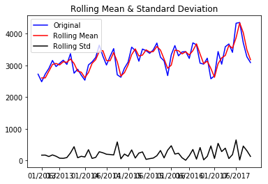
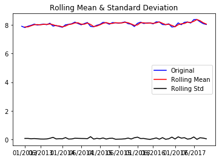
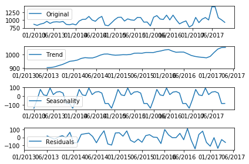

```python
#all
import plotly.plotly as py
import pandas as pd
import plotly
import numpy as np

plotly.tools.set_credentials_file(username='alexander.lee08', api_key='ontLNLDpfu7vDDCwYalZ')
#time to completion-- types of permits completed
#correlate (completed) permits per area
#prediction test set as year

df = pd.read_csv('Google Drive/Python/capstone/Building_Permits.csv')
df2 = df.drop(['Street Number Suffix', 'Fire Only Permit', 'Unit', 'Unit Suffix', 'Structural Notification', 'Voluntary Soft-Story Retrofit', 'TIDF Compliance', 'Site Permit'], axis=1)
```

    /usr/local/lib/python3.6/site-packages/IPython/core/interactiveshell.py:2728: DtypeWarning:
    
    Columns (22,32) have mixed types. Specify dtype option on import or set low_memory=False.
    


```python
#set ticks for dates
ticks = [1,6,13,19,25,31,37,42,49,55]
dates = ['01/2013', '06/2013', '01/2014', '06/2014', '01/2015', '06/2015', '01/2016', '06/2016', '01/2017', '06/2017']
```


```python
#set the areas
df2['Year'] = df2['Permit Creation Date'].apply(lambda x: x.split('/')[2])
df2['Month'] = df2['Permit Creation Date'].apply(lambda x: x.split('/')[0])

areas = list()
areas.append(['North Beach', 'Japantown', 'Treasure Island', 'Western Addition', 'Marina', 'Financial District/South Beach', 'Chinatown', 'Pacific Heights', 'Hayes Valley', 'Nob Hill', 'Russian Hill', 'Tenderloin'])
areas.append(['Presidio Heights', 'Presidio', 'Outer Richmond', 'Inner Richmond', 'Golden Gate Park', 'Seacliff', 'Lone Mountain/USF'])
areas.append(['Sunset/Parkside', 'Inner Sunset', 'West of Twin Peaks', 'Lakeshore', 'Oceanview/Merced/Ingleside'])
areas.append(['Twin Peaks', 'Glen Park', 'South of Market', 'Mission Bay', 'Bernal Heights', 'Mission', 'Noe Valley', 'Castro/Upper Market', 'Haight Ashbury', 'Potrero Hill'])
areas.append(['McLaren Park', 'Outer Mission', 'Excelsior', 'Portola', 'Bayview Hunters Point', 'Visitacion Valley'])

df2 = df2[df2['Neighborhoods - Analysis Boundaries'] != 'nan']

df2 = df2[df2['Neighborhoods - Analysis Boundaries'] != 'nan']

def area_group(x):
    for i, area in enumerate(areas):
        if (x in area):
            return i

df2['Area'] = df2['Neighborhoods - Analysis Boundaries'].apply(lambda x: area_group(x))
```


```python
#create function to check stationarity
def check_stationarity(timeseries):
    
    #Determing rolling statistics
    rolling_mean = pd.DataFrame(timeseries).rolling(window=2,center=False).mean() 
    rolling_std = pd.DataFrame(timeseries).rolling(window=2,center=False).std()

    #Plot rolling statistics:
    original = plt.plot(range(len(timeseries)), timeseries, color='blue',label='Original')
    mean = plt.plot(rolling_mean.index, rolling_mean.values, color='red', label='Rolling Mean')
    std = plt.plot(rolling_std.index, rolling_std.values, color='black', label = 'Rolling Std')
    plt.legend(loc='best')
    plt.xticks(ticks, dates)
    plt.title('Rolling Mean & Standard Deviation')
    plt.show(block=False)
    
    #Perform Dickey-Fuller test:
    print ('Results of Dickey-Fuller Test:')
    dickey_fuller_test = adfuller(timeseries, autolag='AIC')
    dfresults = pd.Series(dickey_fuller_test[0:4], index=['Test Statistic','p-value','#Lags Used','Number of Observations Used'])
    for key,value in dickey_fuller_test[4].items():
        dfresults['Critical Value (%s)'%key] = value
    print (dfresults)
```


```python
#create time series
timeseries = list()
years = [2013, 2014, 2015, 2016, 2017]
months = ['01', '02', '03', '04', '05', '06', '07', '08', '09', '10', '11', '12']
for i in range(5):
    temp = list()
    for year in years:
        for month in months:
            temp.append(len(df2[(df2['Area'] == i) & (df2['Year'] ==  str(year)) & (df2['Month'] == str(month))]))
    timeseries.append(temp)
```


```python
import matplotlib.pylab as plt
%matplotlib inline
from matplotlib.pylab import rcParams
rcParams['figure.figsize'] = 15, 6
import requests, pandas as pd, numpy as np
from pandas import DataFrame
from io import StringIO
import time, json
from datetime import date
import statsmodels
from statsmodels.tsa.stattools import adfuller, acf, pacf
from statsmodels.tsa.arima_model import ARIMA
from statsmodels.tsa.seasonal import seasonal_decompose
from sklearn.metrics import mean_squared_error
```


```python
#create and map areas
import math
import plotly.graph_objs as go

def split_lat(x):
    x = str(x)
    x = x[1:]
    x = x[:-1]
    return x.split(',')[0]

def split_long(x):
    x = str(x)
    x = x[1:]
    x = x[:-1]
    return x.split(',')[1]

colors = ["#FF0000", "#00FF00", "#0000FF", "#444444", "#CCCC00"]

data = list()
i = 0
for i in range(5):
    df3 = df2[(df2['Year'] == '2018') & (df2['Area'] == i)]
    loc = df3['Location']
    neigh = 'area ' + str(i)
    
    lat = loc.apply(lambda x: split_lat(x))
    long = loc.apply(lambda x: split_long(x))

    data.append(go.Scattermapbox(
                name = neigh,
                lat= lat,
                lon= long,
                mode='markers',
                marker=dict(
                    size= 5,
                    color = colors[i],
                    opacity = .8,
                ),
              ))
    i += 1

layout = go.Layout(autosize=False,
                   mapbox= dict(
                                bearing=0,
                                pitch=0,
                                zoom=11,
                                center= dict(
                                         lat=37.7648,
                                         lon=-122.463),
                               ),
                    width=1024,
                    height=640, title = "Permit Layout via group")

fig = dict( data=data, layout=layout )
py.iplot( fig, filename='sf-permits-coloration-groups' )
```


<iframe id="igraph" scrolling="no" style="border:none;" seamless="seamless" src="https://plot.ly/~alexander.lee08/10.embed" height="640px" width="1024px"></iframe>


```python
#create city dataframe
years = [2013, 2014, 2015, 2016, 2017]
months = ['01', '02', '03', '04', '05', '06', '07', '08', '09', '10', '11', '12']
all = list()
for year in years:
    for month in months:
        temp1 = len(df2[(df2['Year'] ==  str(year)) & (df2['Month'] == str(month))])
        all.append(temp1)
```

# Total City


```python
check_stationarity(all)
```





    Results of Dickey-Fuller Test:
    Test Statistic                 -1.194626
    p-value                         0.675903
    #Lags Used                     11.000000
    Number of Observations Used    48.000000
    Critical Value (1%)            -3.574589
    Critical Value (5%)            -2.923954
    Critical Value (10%)           -2.600039
    dtype: float64


```python
t1_log = np.log(all)
check_stationarity(t1_log)
```





    Results of Dickey-Fuller Test:
    Test Statistic                 -1.268435
    p-value                         0.643487
    #Lags Used                     11.000000
    Number of Observations Used    48.000000
    Critical Value (1%)            -3.574589
    Critical Value (5%)            -2.923954
    Critical Value (10%)           -2.600039
    dtype: float64


```python
t1_log_dif = pd.DataFrame(t1_log)- pd.DataFrame(t1_log).shift()
plt.plot(t1_log_dif.index, t1_log_dif.values)
plt.ylabel('variance')
plt.xticks(ticks, dates)
plt.xlabel('time index')
```


    Text(0.5,0,'time index')


```python
decomposition = seasonal_decompose(all, freq=12)
ticks = [0,6,13,19,25,31,37,42,49,55]

trend = decomposition.trend
seasonal = decomposition.seasonal
residual = decomposition.resid

# Select the most recent weeks 

plt.subplot(411)
plt.plot(range(len(all)), all, label='Original')
plt.xticks(ticks, dates)
plt.legend(loc='best')
plt.subplot(412)
plt.plot(range(len(all)), trend, label='Trend')
plt.xticks(ticks, dates)
plt.legend(loc='best')
plt.subplot(413)
plt.plot(range(len(all)), seasonal,label='Seasonality')
plt.xticks(ticks, dates)
plt.legend(loc='best')
plt.subplot(414)
plt.plot(range(len(all)), residual, label='Residuals')
plt.xticks(ticks, dates)
plt.legend(loc='best')
plt.tight_layout()
```


```python
t1_log_dif.dropna(inplace=True)
check_stationarity(t1_log_dif.iloc[:,0].values)
```


    Results of Dickey-Fuller Test:
    Test Statistic                -6.328910e+00
    p-value                        2.939277e-08
    #Lags Used                     1.000000e+01
    Number of Observations Used    4.800000e+01
    Critical Value (1%)           -3.574589e+00
    Critical Value (5%)           -2.923954e+00
    Critical Value (10%)          -2.600039e+00
    dtype: float64


```python
#ACF and PACF plots
t1_log_dif.dropna(inplace=True)

lag_auto_corr = acf(t1_log_dif, nlags=20)
lag_par_auto_corr = pacf(t1_log_dif, method='ols', nlags=20)

#Plot ACF: 
plt.figure(figsize=(20,5))
plt.subplot(121) 
plt.plot(lag_auto_corr)
plt.axhline(y=0,linestyle='--',color='black')
plt.axhline(y=-1.96/np.sqrt(len(t1_log_dif)),linestyle='--',color='black')
plt.axhline(y=1.96/np.sqrt(len(t1_log_dif)),linestyle='--',color='black')
plt.xticks(range(20))
plt.title('Autocorrelation Function')

#Plot PACF:
plt.subplot(122)
plt.plot(lag_par_auto_corr)
plt.axhline(y=0,linestyle='--',color='black')
plt.axhline(y=-1.96/np.sqrt(len(t1_log_dif)),linestyle='--',color='black')
plt.axhline(y=1.96/np.sqrt(len(t1_log_dif)),linestyle='--',color='black')
plt.xticks(range(20))
plt.title('Partial Autocorrelation Function')
plt.tight_layout()
```


```python
model = ARIMA(t1_log, order=(1,1,1))  
results_ARIMA = model.fit(disp=-1)  
plt.plot(range(len(t1_log)), t1_log)
plt.plot(range(len(t1_log)-1), results_ARIMA.fittedvalues, color='red')
plt.title('RSS: %.4f'% sum((results_ARIMA.fittedvalues.reshape(-1,1)-t1_log_dif)**2))
```


    Text(0.5,1,'RSS: 0.0000')


```python
print(results_ARIMA.summary())
# plot residual errors
residuals = DataFrame(results_ARIMA.resid)
residuals.plot(kind='kde')
print(residuals.describe())
```

                                 ARIMA Model Results                              
    ==============================================================================
    Dep. Variable:                    D.y   No. Observations:                   59
    Model:                 ARIMA(1, 1, 1)   Log Likelihood                  53.120
    Method:                       css-mle   S.D. of innovations              0.096
    Date:                Fri, 23 Nov 2018   AIC                            -98.240
    Time:                        20:25:24   BIC                            -89.930
    Sample:                             1   HQIC                           -94.996
                                                                                  
    ==============================================================================
                     coef    std err          z      P>|z|      [0.025      0.975]
    ------------------------------------------------------------------------------
    const          0.0033      0.001      2.596      0.012       0.001       0.006
    ar.L1.D.y      0.4584      0.120      3.807      0.000       0.222       0.694
    ma.L1.D.y     -1.0000      0.046    -21.687      0.000      -1.090      -0.910
                                        Roots                                    
    =============================================================================
                      Real          Imaginary           Modulus         Frequency
    -----------------------------------------------------------------------------
    AR.1            2.1814           +0.0000j            2.1814            0.0000
    MA.1            1.0000           +0.0000j            1.0000            0.0000
    -----------------------------------------------------------------------------
                   0
    count  59.000000
    mean    0.005528
    std     0.098523
    min    -0.254769
    25%    -0.058614
    50%     0.016272
    75%     0.081088
    max     0.230979


```python
size = int(len(t1_log) - 12)
train, test = t1_log[0:size], t1_log[size:len(t1_log)]
historical = [x for x in train]
predictions = list()
con_up = list()
con_do =list()
print('Printing Predicted vs Expected Values...')
print('\n')
for t in range(len(test)):
    model = ARIMA(historical, order=(1,1,1))
    model_fit = model.fit(disp=-1)
    output = model_fit.forecast()
    con_up.append(output[2][0][1])
    con_do.append(output[2][0][0])
    yhat = output[0]
    predictions.append(float(yhat))
    observed = test[t]
    historical.append(observed)
    print('Predicted Rate = %f, Expected Rate = %f' % (yhat, observed))

error = mean_squared_error(test, predictions)

print('\n')
print('Printing Mean Squared Error of Predictions...')
print('Test MSE: %.6f' % error)

predictions_series = pd.Series(predictions, index = range(len(test)))
```

    Printing Predicted vs Expected Values...
    
    
    Predicted Rate = 8.122504, Expected Rate = 7.854769
    Predicted Rate = 8.004692, Expected Rate = 7.890583
    Predicted Rate = 7.995195, Expected Rate = 8.142354
    Predicted Rate = 8.130230, Expected Rate = 8.018955
    Predicted Rate = 8.073206, Expected Rate = 8.185350
    Predicted Rate = 8.150817, Expected Rate = 8.209580
    Predicted Rate = 8.168397, Expected Rate = 8.135054
    Predicted Rate = 8.137309, Expected Rate = 8.373323
    Predicted Rate = 8.252590, Expected Rate = 8.378850
    Predicted Rate = 8.278266, Expected Rate = 8.218787
    Predicted Rate = 8.202158, Expected Rate = 8.093157
    Predicted Rate = 8.141676, Expected Rate = 8.035603
    
    
    Printing Mean Squared Error of Predictions...
    Test MSE: 0.019516


```python
fig, ax = plt.subplots(figsize=(20,7))
ax.set(title='Total Number of Permits Opened in SF', xlabel='Date', ylabel='permit number')
ax.plot(all, label='observed')
ax.plot(range(48, 48+len(predictions_series)), np.exp(predictions_series), 'g', label='rolling one-step out-of-sample forecast')
ax.fill_between(range(48, 48+len(predictions_series)), np.exp(con_do), np.exp(con_up), color='k', alpha=.2)
#ax.plot(np.exp(con_up))
#ax.plot(np.exp(con_do))
plt.xticks(ticks, dates)
legend = ax.legend(loc='upper left')
legend.get_frame().set_facecolor('w')
```


# Area 0


```python
#start area 0
check_stationarity(timeseries[0])
```


    Results of Dickey-Fuller Test:
    Test Statistic                 -0.865160
    p-value                         0.799229
    #Lags Used                     11.000000
    Number of Observations Used    48.000000
    Critical Value (1%)            -3.574589
    Critical Value (5%)            -2.923954
    Critical Value (10%)           -2.600039
    dtype: float64


```python
t1_log = np.log(timeseries[0])
```


```python
check_stationarity(t1_log)
```


    Results of Dickey-Fuller Test:
    Test Statistic                 -0.878210
    p-value                         0.795064
    #Lags Used                     11.000000
    Number of Observations Used    48.000000
    Critical Value (1%)            -3.574589
    Critical Value (5%)            -2.923954
    Critical Value (10%)           -2.600039
    dtype: float64


```python
t1_log_dif = pd.DataFrame(t1_log)- pd.DataFrame(t1_log).shift()
plt.plot(t1_log_dif.index, t1_log_dif.values)
```


    [<matplotlib.lines.Line2D at 0x114d47b70>]


```python
t1_log_dif.dropna(inplace=True)
check_stationarity(t1_log_dif.iloc[:,0].values)
```


    Results of Dickey-Fuller Test:
    Test Statistic                -6.219267e+00
    p-value                        5.271992e-08
    #Lags Used                     1.000000e+01
    Number of Observations Used    4.800000e+01
    Critical Value (1%)           -3.574589e+00
    Critical Value (5%)           -2.923954e+00
    Critical Value (10%)          -2.600039e+00
    dtype: float64


```python
decomposition = seasonal_decompose(timeseries[0], freq=12)

trend = decomposition.trend
seasonal = decomposition.seasonal
residual = decomposition.resid

# Select the most recent weeks 

plt.subplot(411)
plt.plot(range(len(timeseries[0])), timeseries[0], label='Original')
plt.xticks(ticks, dates)
plt.legend(loc='best')
plt.subplot(412)
plt.plot(range(len(timeseries[0])), trend, label='Trend')
plt.xticks(ticks, dates)
plt.legend(loc='best')
plt.subplot(413)
plt.plot(range(len(timeseries[0])), seasonal,label='Seasonality')
plt.xticks(ticks, dates)
plt.legend(loc='best')
plt.subplot(414)
plt.plot(range(len(timeseries[0])), residual, label='Residuals')
plt.xticks(ticks, dates)
plt.legend(loc='best')
plt.tight_layout()
```


```python
check_stationarity(t1_log_dif.iloc[:,0].values)
```


    Results of Dickey-Fuller Test:
    Test Statistic                -6.219267e+00
    p-value                        5.271992e-08
    #Lags Used                     1.000000e+01
    Number of Observations Used    4.800000e+01
    Critical Value (1%)           -3.574589e+00
    Critical Value (5%)           -2.923954e+00
    Critical Value (10%)          -2.600039e+00
    dtype: float64


```python
#ACF and PACF plots

lag_auto_corr = acf(t1_log_dif, nlags=20)
lag_par_auto_corr = pacf(t1_log_dif, nlags=20, method='ols')

#Plot ACF: 
plt.figure(figsize=(20,5))
plt.subplot(121) 
plt.plot(lag_auto_corr)
plt.axhline(y=0,linestyle='--',color='black')
plt.axhline(y=-1.96/np.sqrt(len(t1_log_dif)),linestyle='--',color='black')
plt.axhline(y=1.96/np.sqrt(len(t1_log_dif)),linestyle='--',color='black')
plt.xticks(range(20))
plt.title('Autocorrelation Function')

#Plot PACF:
plt.subplot(122)
plt.plot(lag_par_auto_corr)
plt.axhline(y=0,linestyle='--',color='black')
plt.axhline(y=-1.96/np.sqrt(len(t1_log_dif)),linestyle='--',color='black')
plt.axhline(y=1.96/np.sqrt(len(t1_log_dif)),linestyle='--',color='black')
plt.xticks(range(20))
plt.title('Partial Autocorrelation Function')
plt.tight_layout()
```


```python
size = int(len(t1_log) - 12)
train, test = t1_log[0:size], t1_log[size:len(t1_log)]
historical = [x for x in train]
predictions = list()
con_up = list()
con_do = list()
print('Printing Predicted vs Expected Values...')
print('\n')
for t in range(len(test)):
    model = ARIMA(historical, order=(1,1,1))
    model_fit = model.fit(disp=0)
    output = model_fit.forecast()
    con_up.append(output[2][0][1])
    con_do.append(output[2][0][0])
    yhat = output[0]
    predictions.append(float(yhat))
    observed = test[t]
    historical.append(observed)
    print('Predicted Rate = %f, Expected Rate = %f' % (yhat, observed))

error = mean_squared_error(test, predictions)

print('\n')
print('Printing Mean Squared Error of Predictions...')
print('Test MSE: %.6f' % error)

predictions_series = pd.Series(predictions, index = range(len(test)))
```

    Printing Predicted vs Expected Values...
    
    
    Predicted Rate = 7.136435, Expected Rate = 6.871091
    Predicted Rate = 7.060124, Expected Rate = 6.919684
    Predicted Rate = 7.049540, Expected Rate = 7.085064
    Predicted Rate = 7.106692, Expected Rate = 7.013016
    Predicted Rate = 7.080472, Expected Rate = 7.210080
    Predicted Rate = 7.149662, Expected Rate = 7.210818
    Predicted Rate = 7.158368, Expected Rate = 7.131699
    Predicted Rate = 7.135289, Expected Rate = 7.313887
    Predicted Rate = 7.203028, Expected Rate = 7.313220
    Predicted Rate = 7.218713, Expected Rate = 7.237778
    Predicted Rate = 7.198597, Expected Rate = 7.126891
    Predicted Rate = 7.160179, Expected Rate = 6.981006
    
    
    Printing Mean Squared Error of Predictions...
    Test MSE: 0.016922


```python
model = ARIMA(t1_log, order=(1,1,1))  
results_ARIMA = model.fit(disp=-1)  
print(results_ARIMA.summary())
# plot residual errors
residuals = DataFrame(results_ARIMA.resid)
residuals.plot(kind='kde')
print(residuals.describe())
```

                                 ARIMA Model Results                              
    ==============================================================================
    Dep. Variable:                    D.y   No. Observations:                   59
    Model:                 ARIMA(1, 1, 1)   Log Likelihood                  47.354
    Method:                       css-mle   S.D. of innovations              0.105
    Date:                Fri, 23 Nov 2018   AIC                            -86.708
    Time:                        20:46:26   BIC                            -78.398
    Sample:                             1   HQIC                           -83.464
                                                                                  
    ==============================================================================
                     coef    std err          z      P>|z|      [0.025      0.975]
    ------------------------------------------------------------------------------
    const          0.0033      0.001      2.811      0.007       0.001       0.006
    ar.L1.D.y      0.3452      0.128      2.696      0.009       0.094       0.596
    ma.L1.D.y     -1.0000      0.045    -22.039      0.000      -1.089      -0.911
                                        Roots                                    
    =============================================================================
                      Real          Imaginary           Modulus         Frequency
    -----------------------------------------------------------------------------
    AR.1            2.8972           +0.0000j            2.8972            0.0000
    MA.1            1.0000           +0.0000j            1.0000            0.0000
    -----------------------------------------------------------------------------
                   0
    count  59.000000
    mean    0.006851
    std     0.108876
    min    -0.268076
    25%    -0.069424
    50%     0.014784
    75%     0.093702
    max     0.241672


```python
fig, ax = plt.subplots(figsize=(20,7))
ax.set(title='Total Number of Permits Opened in Area 0', xlabel='Date', ylabel='permit number')
ax.plot(timeseries[0], label='observed')
ax.plot(range(48, 48+len(predictions_series)), np.exp(predictions_series), 'g', label='rolling one-step out-of-sample forecast')
ax.fill_between(range(48, 48+len(predictions_series)), np.exp(con_do), np.exp(con_up), color='k', alpha=.2)
#ax.plot(np.exp(con_up))
#ax.plot(np.exp(con_do))
plt.xticks(ticks, dates)
legend = ax.legend(loc='upper left')
legend.get_frame().set_facecolor('w')
```


# Area 1


```python
check_stationarity(timeseries[1])
```


    Results of Dickey-Fuller Test:
    Test Statistic                 -0.399059
    p-value                         0.910256
    #Lags Used                     11.000000
    Number of Observations Used    48.000000
    Critical Value (1%)            -3.574589
    Critical Value (5%)            -2.923954
    Critical Value (10%)           -2.600039
    dtype: float64


```python
t1_log = np.log(timeseries[1])
check_stationarity(t1_log)
```


    Results of Dickey-Fuller Test:
    Test Statistic                 -0.747742
    p-value                         0.833993
    #Lags Used                     11.000000
    Number of Observations Used    48.000000
    Critical Value (1%)            -3.574589
    Critical Value (5%)            -2.923954
    Critical Value (10%)           -2.600039
    dtype: float64


```python
t1_log_dif = pd.DataFrame(t1_log)- pd.DataFrame(t1_log).shift()
plt.plot(t1_log_dif.index, t1_log_dif.values)
```


    [<matplotlib.lines.Line2D at 0x120bdf160>]


```python
t1_log_dif.dropna(inplace=True)
decomposition = seasonal_decompose(timeseries[1], freq=12)

trend = decomposition.trend
seasonal = decomposition.seasonal
residual = decomposition.resid

# Select the most recent weeks 

plt.subplot(411)
plt.plot(range(len(timeseries[1])), timeseries[1], label='Original')
plt.xticks(ticks, dates)
plt.legend(loc='best')
plt.subplot(412)
plt.plot(range(len(timeseries[1])), trend, label='Trend')
plt.xticks(ticks, dates)
plt.legend(loc='best')
plt.subplot(413)
plt.plot(range(len(timeseries[1])), seasonal,label='Seasonality')
plt.xticks(ticks, dates)
plt.legend(loc='best')
plt.subplot(414)
plt.plot(range(len(timeseries[1])), residual, label='Residuals')
plt.xticks(ticks, dates)
plt.legend(loc='best')
plt.tight_layout()
```


```python
check_stationarity(t1_log_dif.iloc[:,0].values)
```


    Results of Dickey-Fuller Test:
    Test Statistic                 -5.219304
    p-value                         0.000008
    #Lags Used                     10.000000
    Number of Observations Used    48.000000
    Critical Value (1%)            -3.574589
    Critical Value (5%)            -2.923954
    Critical Value (10%)           -2.600039
    dtype: float64


```python
#ACF and PACF plots

lag_auto_corr = acf(t1_log_dif, nlags=20)
lag_par_auto_corr = pacf(t1_log_dif, nlags=20, method='ols')

#Plot ACF: 
plt.figure(figsize=(20,5))
plt.subplot(121) 
plt.plot(lag_auto_corr)
plt.axhline(y=0,linestyle='--',color='black')
plt.axhline(y=-1.96/np.sqrt(len(t1_log_dif)),linestyle='--',color='black')
plt.axhline(y=1.96/np.sqrt(len(t1_log_dif)),linestyle='--',color='black')
plt.xticks(range(20))
plt.title('Autocorrelation Function')

#Plot PACF:
plt.subplot(122)
plt.plot(lag_par_auto_corr)
plt.axhline(y=0,linestyle='--',color='black')
plt.axhline(y=-1.96/np.sqrt(len(t1_log_dif)),linestyle='--',color='black')
plt.axhline(y=1.96/np.sqrt(len(t1_log_dif)),linestyle='--',color='black')
plt.xticks(range(20))
plt.title('Partial Autocorrelation Function')
plt.tight_layout()
```


```python
model = ARIMA(t1_log, order=(1,1,1))
model_fit = model.fit(disp=-1)
print(model_fit.summary())
# plot residual errors
residuals = DataFrame(model_fit.resid)
residuals.plot(kind='kde')
print(residuals.describe())
```

                                 ARIMA Model Results                              
    ==============================================================================
    Dep. Variable:                    D.y   No. Observations:                   59
    Model:                 ARIMA(1, 1, 1)   Log Likelihood                  35.513
    Method:                       css-mle   S.D. of innovations              0.129
    Date:                Fri, 23 Nov 2018   AIC                            -63.026
    Time:                        20:50:30   BIC                            -54.715
    Sample:                             1   HQIC                           -59.782
                                                                                  
    ==============================================================================
                     coef    std err          z      P>|z|      [0.025      0.975]
    ------------------------------------------------------------------------------
    const          0.0049      0.002      2.594      0.012       0.001       0.009
    ar.L1.D.y      0.5134      0.118      4.345      0.000       0.282       0.745
    ma.L1.D.y     -1.0000      0.045    -22.372      0.000      -1.088      -0.912
                                        Roots                                    
    =============================================================================
                      Real          Imaginary           Modulus         Frequency
    -----------------------------------------------------------------------------
    AR.1            1.9478           +0.0000j            1.9478            0.0000
    MA.1            1.0000           +0.0000j            1.0000            0.0000
    -----------------------------------------------------------------------------
                   0
    count  59.000000
    mean    0.004493
    std     0.133439
    min    -0.279162
    25%    -0.086556
    50%     0.022610
    75%     0.086715
    max     0.313846


```python
size = int(len(t1_log) - 12)
train, test = t1_log[0:size], t1_log[size:len(t1_log)]
historical = [x for x in train]
predictions = list()

con_up = list()
con_do =list()

print('Printing Predicted vs Expected Values...')
print('\n')
for t in range(len(test)):
    model = ARIMA(historical, order=(1,1,1))
    model_fit = model.fit(disp=-1)
    output = model_fit.forecast()
    con_up.append(output[2][0][1])
    con_do.append(output[2][0][0])
    yhat = output[0]
    predictions.append(float(yhat))
    observed = test[t]
    historical.append(observed)
    print('Predicted Rate = %f, Expected Rate = %f' % (yhat, observed))

error = mean_squared_error(test, predictions)

print('\n')
print('Printing Mean Squared Error of Predictions...')
print('Test MSE: %.6f' % error)

predictions_series = pd.Series(predictions, index = range(len(test)))
```

    Printing Predicted vs Expected Values...
    
    


    /usr/local/lib/python3.6/site-packages/statsmodels/base/model.py:508: ConvergenceWarning:
    
    Maximum Likelihood optimization failed to converge. Check mle_retvals
    


    Predicted Rate = 5.879186, Expected Rate = 5.602119
    Predicted Rate = 5.746054, Expected Rate = 5.707110
    Predicted Rate = 5.786683, Expected Rate = 5.888878
    Predicted Rate = 5.877323, Expected Rate = 5.905362
    Predicted Rate = 5.890026, Expected Rate = 5.996452
    Predicted Rate = 5.939678, Expected Rate = 5.983936
    Predicted Rate = 5.941066, Expected Rate = 5.976351
    Predicted Rate = 5.942858, Expected Rate = 6.182085
    Predicted Rate = 6.058170, Expected Rate = 6.378426
    Predicted Rate = 6.212245, Expected Rate = 6.073045
    Predicted Rate = 6.035730, Expected Rate = 5.877736
    Predicted Rate = 5.930760, Expected Rate = 5.720312
    
    
    Printing Mean Squared Error of Predictions...
    Test MSE: 0.029372


```python
fig, ax = plt.subplots(figsize=(20,7))
ax.set(title='Total Number of Permits Opened in Area 1', xlabel='Date', ylabel='permit number')
ax.plot(timeseries[1], label='observed')
ax.plot(range(48, 48+len(predictions_series)), np.exp(predictions_series), 'g', label='rolling one-step out-of-sample forecast')
ax.fill_between(range(48, 48+len(predictions_series)), np.exp(con_do), np.exp(con_up), color='k', alpha=.2)
#ax.plot(np.exp(con_up))
#ax.plot(np.exp(con_do))
plt.xticks(ticks, dates)
legend = ax.legend(loc='upper left')
legend.get_frame().set_facecolor('w')
```


# Area 2


```python
check_stationarity(timeseries[2])
```


    Results of Dickey-Fuller Test:
    Test Statistic                 -5.063911
    p-value                         0.000017
    #Lags Used                      0.000000
    Number of Observations Used    59.000000
    Critical Value (1%)            -3.546395
    Critical Value (5%)            -2.911939
    Critical Value (10%)           -2.593652
    dtype: float64


```python
check_stationarity(np.log(timeseries[2]))
```


    Results of Dickey-Fuller Test:
    Test Statistic                 -4.943742
    p-value                         0.000029
    #Lags Used                      0.000000
    Number of Observations Used    59.000000
    Critical Value (1%)            -3.546395
    Critical Value (5%)            -2.911939
    Critical Value (10%)           -2.593652
    dtype: float64


```python
#ACF and PACF plots

lag_auto_corr = acf(np.log(timeseries[2]), nlags=20)
lag_par_auto_corr = pacf(np.log(timeseries[2]), nlags=20, method='ols')

#Plot ACF: 
plt.figure(figsize=(20,5))
plt.subplot(121) 
plt.plot(lag_auto_corr)
plt.axhline(y=0,linestyle='--',color='black')
plt.axhline(y=-1.96/np.sqrt(len(timeseries[2])),linestyle='--',color='black')
plt.axhline(y=1.96/np.sqrt(len(timeseries[2])),linestyle='--',color='black')
plt.xticks(range(20))
plt.title('Autocorrelation Function')

#Plot PACF:
plt.subplot(122)
plt.plot(lag_par_auto_corr)
plt.axhline(y=0,linestyle='--',color='black')
plt.axhline(y=-1.96/np.sqrt(len(timeseries[2])),linestyle='--',color='black')
plt.axhline(y=1.96/np.sqrt(len(timeseries[2])),linestyle='--',color='black')
plt.xticks(range(20))
plt.title('Partial Autocorrelation Function')
plt.tight_layout()
```


```python
size = int(len(t1_log) - 12)
train, test = t1_log[0:size], t1_log[size:len(t1_log)]
historical = [x for x in train]
predictions = list()

con_up = list()
con_do =list()

print('Printing Predicted vs Expected Values...')
print('\n')
for t in range(len(test)):
    try:
        model = ARIMA(historical, order=(2,1,1))
        model_fit = model.fit(disp=-1)
        output = model_fit.forecast()
        con_up.append(output[2][0][1])
        con_do.append(output[2][0][0])
        yhat = output[0]
        predictions.append(float(yhat))
        observed = test[t]
        historical.append(observed)
        print('Predicted Rate = %f, Expected Rate = %f' % (yhat, observed))
    except:
        pass

error = mean_squared_error(test, predictions)

print('\n')
print('Printing Mean Squared Error of Predictions...')
print('Test MSE: %.6f' % error)

predictions_series = pd.Series(predictions, index = range(len(test)))
```

    Printing Predicted vs Expected Values...
    
    
    Predicted Rate = 5.883064, Expected Rate = 5.602119
    Predicted Rate = 5.746214, Expected Rate = 5.707110
    Predicted Rate = 5.787506, Expected Rate = 5.888878
    Predicted Rate = 5.882699, Expected Rate = 5.905362
    Predicted Rate = 5.889287, Expected Rate = 5.996452
    Predicted Rate = 5.939674, Expected Rate = 5.983936
    Predicted Rate = 5.937834, Expected Rate = 5.976351
    Predicted Rate = 5.940543, Expected Rate = 6.182085
    Predicted Rate = 6.058346, Expected Rate = 6.378426
    Predicted Rate = 6.210651, Expected Rate = 6.073045
    Predicted Rate = 6.023090, Expected Rate = 5.877736
    Predicted Rate = 5.915394, Expected Rate = 5.720312
    
    
    Printing Mean Squared Error of Predictions...
    Test MSE: 0.028758


```python
model = ARIMA(historical, order=(2,1,1))
model_fit = model.fit(disp=-1)
print(model_fit.summary())
# plot residual errors
residuals = DataFrame(model_fit.resid)
residuals.plot(kind='kde')
print(residuals.describe())
```

                                 ARIMA Model Results                              
    ==============================================================================
    Dep. Variable:                    D.y   No. Observations:                   59
    Model:                 ARIMA(2, 1, 1)   Log Likelihood                  35.932
    Method:                       css-mle   S.D. of innovations              0.128
    Date:                Fri, 23 Nov 2018   AIC                            -61.864
    Time:                        21:12:03   BIC                            -51.476
    Sample:                             1   HQIC                           -57.809
                                                                                  
    ==============================================================================
                     coef    std err          z      P>|z|      [0.025      0.975]
    ------------------------------------------------------------------------------
    const          0.0049      0.002      2.934      0.005       0.002       0.008
    ar.L1.D.y      0.5698      0.132      4.315      0.000       0.311       0.829
    ar.L2.D.y     -0.1232      0.134     -0.922      0.361      -0.385       0.139
    ma.L1.D.y     -1.0000      0.046    -21.776      0.000      -1.090      -0.910
                                        Roots                                    
    =============================================================================
                      Real          Imaginary           Modulus         Frequency
    -----------------------------------------------------------------------------
    AR.1            2.3132           -1.6638j            2.8494           -0.0992
    AR.2            2.3132           +1.6638j            2.8494            0.0992
    MA.1            1.0000           +0.0000j            1.0000            0.0000
    -----------------------------------------------------------------------------
                   0
    count  59.000000
    mean    0.004550
    std     0.132577
    min    -0.292670
    25%    -0.093544
    50%     0.019736
    75%     0.085796
    max     0.305483


```python
fig, ax = plt.subplots(figsize=(20,7))
ax.set(title='Total Number of Permits Opened in Area 2', xlabel='Date', ylabel='permit number')
ax.plot(timeseries[2], label='observed')
ax.plot(range(48, 48+len(predictions_series)), np.exp(predictions_series), 'g', label='rolling one-step out-of-sample forecast')
ax.fill_between(range(48, 48+len(predictions_series)), np.exp(con_do), np.exp(con_up), color='k', alpha=.2)
#ax.plot(np.exp(con_up))
#ax.plot(np.exp(con_do))
plt.xticks(ticks, dates)
legend = ax.legend(loc='upper left')
legend.get_frame().set_facecolor('w')
```


# Area 3


```python
check_stationarity(timeseries[3])
```


    Results of Dickey-Fuller Test:
    Test Statistic                 -2.003420
    p-value                         0.285075
    #Lags Used                     11.000000
    Number of Observations Used    48.000000
    Critical Value (1%)            -3.574589
    Critical Value (5%)            -2.923954
    Critical Value (10%)           -2.600039
    dtype: float64


```python
t1_log = np.log(timeseries[3])
check_stationarity(t1_log)
```


    Results of Dickey-Fuller Test:
    Test Statistic                 -2.138189
    p-value                         0.229438
    #Lags Used                     11.000000
    Number of Observations Used    48.000000
    Critical Value (1%)            -3.574589
    Critical Value (5%)            -2.923954
    Critical Value (10%)           -2.600039
    dtype: float64


```python
t1_log_dif = pd.DataFrame(t1_log)- pd.DataFrame(t1_log).shift(12)
plt.plot(t1_log_dif.index, t1_log_dif.values)
```


    [<matplotlib.lines.Line2D at 0x11bc992e8>]


```python
check_stationarity(t1_log_dif.iloc[:,0].values)
```


    Results of Dickey-Fuller Test:
    Test Statistic                 -4.414321
    p-value                         0.000280
    #Lags Used                      0.000000
    Number of Observations Used    47.000000
    Critical Value (1%)            -3.577848
    Critical Value (5%)            -2.925338
    Critical Value (10%)           -2.600774
    dtype: float64


```python
t1_log_dif.dropna(inplace=True)
decomposition = seasonal_decompose(timeseries[3], freq=12)

trend = decomposition.trend
seasonal = decomposition.seasonal
residual = decomposition.resid

# Select the most recent weeks 

plt.subplot(411)
plt.plot(range(len(timeseries[3])), timeseries[3], label='Original')
plt.xticks(ticks, dates)
plt.legend(loc='best')
plt.subplot(412)
plt.plot(range(len(timeseries[3])), trend, label='Trend')
plt.xticks(ticks, dates)
plt.legend(loc='best')
plt.subplot(413)
plt.plot(range(len(timeseries[3])), seasonal,label='Seasonality')
plt.xticks(ticks, dates)
plt.legend(loc='best')
plt.subplot(414)
plt.plot(range(len(timeseries[3])), residual, label='Residuals')
plt.xticks(ticks, dates)
plt.legend(loc='best')
plt.tight_layout()
```





```python
size = int(len(t1_log) - 12)
train, test = t1_log[0:size], t1_log[size:len(t1_log)]
historical = [x for x in train]
predictions = list()

con_up = list()
con_do =list()

import statsmodels.api as sm

print('Printing Predicted vs Expected Values...')
print('\n')
for t in range(len(test)):
    model = ARIMA(historical, order=(2,1,1))
    model_fit = model.fit(disp=-1)
    output = model_fit.forecast()
    con_up.append(output[2][0][1])
    con_do.append(output[2][0][0])
    yhat = output[0]
    predictions.append(float(yhat))
    observed = test[t]
    historical.append(observed)
    print('Predicted Rate = %f, Expected Rate = %f' % (yhat, observed))

error = mean_squared_error(test, predictions)

print('\n')
print('Printing Mean Squared Error of Predictions...')
print('Test MSE: %.6f' % error)

predictions_series = pd.Series(predictions, index = range(len(test)))
```

    Printing Predicted vs Expected Values...
    
    
    Predicted Rate = 6.948332, Expected Rate = 6.654153
    Predicted Rate = 6.808806, Expected Rate = 6.731018
    Predicted Rate = 6.849834, Expected Rate = 6.994850
    Predicted Rate = 6.999542, Expected Rate = 6.824374
    Predicted Rate = 6.875801, Expected Rate = 6.941190
    Predicted Rate = 6.941384, Expected Rate = 6.990257
    Predicted Rate = 6.958320, Expected Rate = 6.914731
    Predicted Rate = 6.922683, Expected Rate = 7.270313
    Predicted Rate = 7.184209, Expected Rate = 7.270313
    Predicted Rate = 7.166350, Expected Rate = 6.983790
    Predicted Rate = 7.121906, Expected Rate = 6.918695
    Predicted Rate = 6.955440, Expected Rate = 6.834109
    
    
    Printing Mean Squared Error of Predictions...
    Test MSE: 0.030873


```python
residuals = DataFrame(residual)
residuals.plot(kind='kde', figsize=(6,4))
print(model_fit.summary())
print(residuals.describe())
```

                                 ARIMA Model Results                              
    ==============================================================================
    Dep. Variable:                    D.y   No. Observations:                   58
    Model:                 ARIMA(2, 1, 1)   Log Likelihood                  48.745
    Method:                       css-mle   S.D. of innovations              0.101
    Date:                Fri, 23 Nov 2018   AIC                            -87.489
    Time:                        21:36:05   BIC                            -77.187
    Sample:                             1   HQIC                           -83.476
                                                                                  
    ==============================================================================
                     coef    std err          z      P>|z|      [0.025      0.975]
    ------------------------------------------------------------------------------
    const          0.0030      0.001      2.651      0.011       0.001       0.005
    ar.L1.D.y      0.4579      0.130      3.518      0.001       0.203       0.713
    ar.L2.D.y     -0.1323      0.130     -1.020      0.312      -0.386       0.122
    ma.L1.D.y     -1.0000      0.050    -20.018      0.000      -1.098      -0.902
                                        Roots                                    
    =============================================================================
                      Real          Imaginary           Modulus         Frequency
    -----------------------------------------------------------------------------
    AR.1            1.7308           -2.1364j            2.7496           -0.1416
    AR.2            1.7308           +2.1364j            2.7496            0.1416
    MA.1            1.0000           +0.0000j            1.0000            0.0000
    -----------------------------------------------------------------------------
                    0
    count   48.000000
    mean    -5.076389
    std     61.055669
    min   -143.878472
    25%    -61.373264
    50%     -1.149306
    75%     37.348090
    max    111.434028


```python
fig, ax = plt.subplots(figsize=(20,7))
ax.set(title='Total Number of Permits Opened in Area 4', xlabel='Date', ylabel='permit number')
ax.plot(timeseries[3], label='observed')
ax.plot(range(48, 48+len(predictions_series)), np.exp(predictions_series), 'g', label='rolling one-step out-of-sample forecast')
ax.fill_between(range(48, 48+len(predictions_series)), np.exp(con_do), np.exp(con_up), color='k', alpha=.2)
#ax.plot(np.exp(con_up))
#ax.plot(np.exp(con_do))
plt.xticks(ticks, dates)
legend = ax.legend(loc='upper left')
legend.get_frame().set_facecolor('w')
```


# Area 4


```python
check_stationarity(timeseries[4])
```


    Results of Dickey-Fuller Test:
    Test Statistic                 -2.582749
    p-value                         0.096615
    #Lags Used                      2.000000
    Number of Observations Used    57.000000
    Critical Value (1%)            -3.550670
    Critical Value (5%)            -2.913766
    Critical Value (10%)           -2.594624
    dtype: float64


```python
t1_log = np.log(timeseries[4])
check_stationarity(t1_log)
```


    Results of Dickey-Fuller Test:
    Test Statistic                 -2.583213
    p-value                         0.096517
    #Lags Used                      2.000000
    Number of Observations Used    57.000000
    Critical Value (1%)            -3.550670
    Critical Value (5%)            -2.913766
    Critical Value (10%)           -2.594624
    dtype: float64


```python
t1_log_dif = pd.DataFrame(t1_log)- pd.DataFrame(t1_log).shift()
plt.plot(t1_log_dif.index, t1_log_dif.values)
```


    [<matplotlib.lines.Line2D at 0x113db56d8>]


```python
t1_log_dif.dropna(inplace=True)
check_stationarity(t1_log_dif.iloc[:,0].values)
```


    Results of Dickey-Fuller Test:
    Test Statistic                -1.148826e+01
    p-value                        4.806022e-21
    #Lags Used                     1.000000e+00
    Number of Observations Used    5.700000e+01
    Critical Value (1%)           -3.550670e+00
    Critical Value (5%)           -2.913766e+00
    Critical Value (10%)          -2.594624e+00
    dtype: float64


```python
#ACF and PACF plots

lag_auto_corr = acf(t1_log_dif, nlags=20)
lag_par_auto_corr = pacf(t1_log_dif, nlags=20, method='ols')

#Plot ACF: 
plt.figure(figsize=(20,5))
plt.subplot(121) 
plt.plot(lag_auto_corr)
plt.axhline(y=0,linestyle='--',color='black')
plt.axhline(y=-1.96/np.sqrt(len(t1_log_dif)),linestyle='--',color='black')
plt.axhline(y=1.96/np.sqrt(len(t1_log_dif)),linestyle='--',color='black')
plt.xticks(range(20))
plt.title('Autocorrelation Function')

#Plot PACF:
plt.subplot(122)
plt.plot(lag_par_auto_corr)
plt.axhline(y=0,linestyle='--',color='black')
plt.axhline(y=-1.96/np.sqrt(len(t1_log_dif)),linestyle='--',color='black')
plt.axhline(y=1.96/np.sqrt(len(t1_log_dif)),linestyle='--',color='black')
plt.xticks(range(20))
plt.title('Partial Autocorrelation Function')
plt.tight_layout()
```


```python
decomposition = seasonal_decompose(timeseries[4], freq=12)

trend = decomposition.trend
seasonal = decomposition.seasonal
residual = decomposition.resid

# Select the most recent weeks 

plt.subplot(411)
plt.plot(range(len(timeseries[4])), timeseries[4], label='Original')
plt.xticks(ticks, dates)
plt.legend(loc='best')
plt.subplot(412)
plt.plot(range(len(timeseries[4])), trend, label='Trend')
plt.xticks(ticks, dates)
plt.legend(loc='best')
plt.subplot(413)
plt.plot(range(len(timeseries[4])), seasonal,label='Seasonality')
plt.xticks(ticks, dates)
plt.legend(loc='best')
plt.subplot(414)
plt.plot(range(len(timeseries[4])), residual, label='Residuals')
plt.xticks(ticks, dates)
plt.legend(loc='best')
plt.tight_layout()
```


```python
size = int(len(t1_log) - 12)
train, test = t1_log[0:size], t1_log[size:len(t1_log)]
historical = [x for x in train]
predictions = list()

con_up = list()
con_do =list()

import statsmodels.api as sm

print('Printing Predicted vs Expected Values...')
print('\n')
for t in range(len(test)):
    model = ARIMA(historical, order=(1,1,1))
    model_fit = model.fit(disp=-1)
    output = model_fit.forecast()
    con_up.append(output[2][0][1])
    con_do.append(output[2][0][0])
    yhat = output[0]
    predictions.append(float(yhat))
    observed = test[t]
    historical.append(observed)
    print('Predicted Rate = %f, Expected Rate = %f' % (yhat, observed))

error = mean_squared_error(test, predictions)

print('\n')
print('Printing Mean Squared Error of Predictions...')
print('Test MSE: %.6f' % error)

predictions_series = pd.Series(predictions, index = range(len(test)))
```

    Printing Predicted vs Expected Values...
    
    
    Predicted Rate = 5.469841, Expected Rate = 5.129899
    Predicted Rate = 5.434817, Expected Rate = 5.075174
    Predicted Rate = 5.387262, Expected Rate = 5.402677
    Predicted Rate = 5.421213, Expected Rate = 5.420535
    Predicted Rate = 5.426836, Expected Rate = 5.455321
    Predicted Rate = 5.435504, Expected Rate = 5.537334
    Predicted Rate = 5.453787, Expected Rate = 5.493061
    Predicted Rate = 5.456771, Expected Rate = 5.634790
    Predicted Rate = 5.486359, Expected Rate = 5.556828
    Predicted Rate = 5.488959, Expected Rate = 5.472271
    Predicted Rate = 5.483731, Expected Rate = 5.298317
    Predicted Rate = 5.458323, Expected Rate = 5.680173
    
    
    Printing Mean Squared Error of Predictions...
    Test MSE: 0.031533


```python
fig, ax = plt.subplots(figsize=(20,7))
ax.set(title='Total Number of Permits Opened in Area 4', xlabel='Date', ylabel='permit number')
ax.plot(timeseries[4], label='observed')
ax.plot(range(48, 48+len(predictions_series)), np.exp(predictions_series), 'g', label='rolling one-step out-of-sample forecast')
ax.fill_between(range(48, 48+len(predictions_series)), np.exp(con_do), np.exp(con_up), color='k', alpha=.2)
#ax.plot(np.exp(con_up))
#ax.plot(np.exp(con_do))
plt.xticks(ticks, dates)
legend = ax.legend(loc='upper left')
legend.get_frame().set_facecolor('w')
```


# Final tests


```python
plt.scatter([0,1,2,3,4], [0.016922, 0.029372, 0.035429, 0.030873, 0.031533])
plt.xticks([4, 3, 2, 1, 0])
plt.xlabel('Areas')
plt.ylabel('MSE')
plt.axhline(y=0.019516,linestyle='--',color='black')
plt.ylim(0,0.05)
plt.title('MSE comparison')
```


    Text(0.5,1,'MSE comparison')


```python

plt.scatter([0,1,2,3,4], [0.006851, 0.004493, -0.000427, -0.004064, -0.004251])
plt.xticks([4, 3, 2, 1, 0])
plt.xlabel('Areas')
plt.ylabel('Mean of Residuals')
plt.axhline(y=0.005528,linestyle='--',color='black')
plt.ylim(-0.02,0.02)
plt.title('Residual Mean Comparison')
```


    Text(0.5,1,'Residual Mean Comparison')


```python
demposition = seasonal_decompose(all, freq=12)

alls = decomposition.seasonal
allt = decomposition.trend
```


```python
seasonal = list()
trend = list()
for index in range(5):
    temp = list()
    temp1 = list()
    decomposition = seasonal_decompose(timeseries[index], freq=12)

    temp1 = decomposition.trend
    temp = decomposition.seasonal
    seasonal.append(temp)
    trend.append(temp1)
    #residual = decomposition.resid
    
```


```python
plt.plot(seasonal[0], label='Area 0')
plt.plot(seasonal[1], label='Area 1')
plt.plot(seasonal[2], label='Area 2')
plt.plot(seasonal[3], label='Area 3')
plt.plot(seasonal[4], label='Area 4')
plt.plot(alls, label='All')
plt.legend()
plt.xticks(ticks, dates)

```


    ([<matplotlib.axis.XTick at 0x1211475f8>,
      <matplotlib.axis.XTick at 0x11bd975f8>,
      <matplotlib.axis.XTick at 0x114a34630>,
      <matplotlib.axis.XTick at 0x12118d438>,
      <matplotlib.axis.XTick at 0x12118d898>,
      <matplotlib.axis.XTick at 0x12118dd68>,
      <matplotlib.axis.XTick at 0x121194278>,
      <matplotlib.axis.XTick at 0x121194748>,
      <matplotlib.axis.XTick at 0x121194c50>,
      <matplotlib.axis.XTick at 0x12119f198>],
     <a list of 10 Text xticklabel objects>)


```python
plt.plot(trend[0], label='Area 0')
plt.plot(trend[1], label='Area 1')
plt.plot(trend[2], label='Area 2')
plt.plot(trend[3], label='Area 3')
plt.plot(trend[4], label='Area 4')
plt.legend()
plt.xticks(ticks, dates)
```


    ([<matplotlib.axis.XTick at 0x1211ce080>,
      <matplotlib.axis.XTick at 0x1211ca978>,
      <matplotlib.axis.XTick at 0x1211ca3c8>,
      <matplotlib.axis.XTick at 0x12126a780>,
      <matplotlib.axis.XTick at 0x12126ac50>,
      <matplotlib.axis.XTick at 0x121273198>,
      <matplotlib.axis.XTick at 0x121273630>,
      <matplotlib.axis.XTick at 0x121273b00>,
      <matplotlib.axis.XTick at 0x12126a5f8>,
      <matplotlib.axis.XTick at 0x1212730b8>],
     <a list of 10 Text xticklabel objects>)


```python
t0 = (np.nanmax(trend[0]) - np.nanmin(trend[0])) / np.nanmean(trend[0])
t1 = (np.nanmax(trend[1]) - np.nanmin(trend[1])) / np.nanmean(trend[1])
t2 = (np.nanmax(trend[2]) - np.nanmin(trend[2])) / np.nanmean(trend[2])
t3 = (np.nanmax(trend[3]) - np.nanmin(trend[3])) / np.nanmean(trend[3])
t4 = (np.nanmax(trend[4]) - np.nanmin(trend[4])) / np.nanmean(trend[4])
ta = (np.nanmax(allt) - np.nanmin(allt)) / np.nanmean(allt)
print(ta)
```

    0.3123160040115166


```python
plt.scatter([0,1,2,3,4], [t0, t1, t2, t3, t4])
plt.xticks([4, 3, 2, 1, 0])
plt.xlabel('Areas')
plt.ylabel('Absolute Ratio Increase')
plt.title('Comparison of Increase')
```


    Text(0.5,1,'Comparison of Increase')


